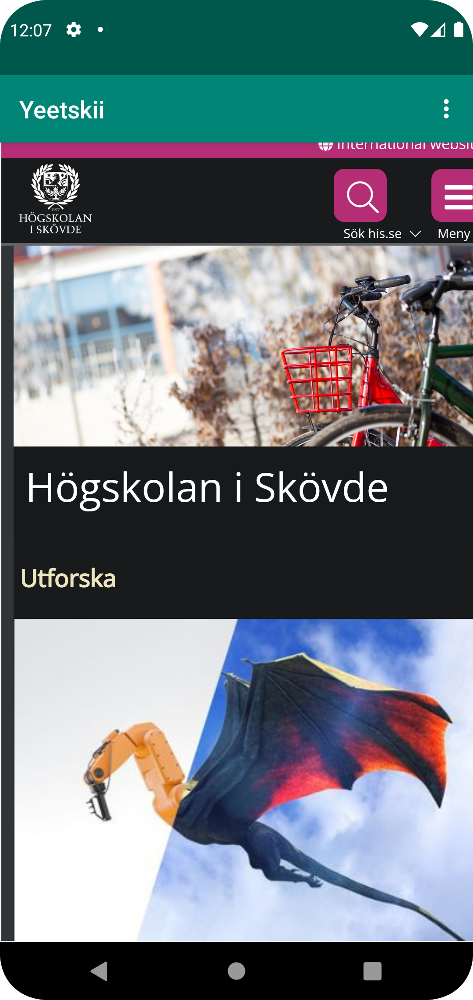

# Rapport

## Följande grundsyn gäller dugga-svar:

För att lösa uppgift 2: WebView, så började jag med att forka samt klona projektet. Därefter följde jag uppgiftsbeskrivningen
för att uppnå alla krav på lösandet av uppgiften.

Jag började med att byta ut namnet på appen från "hello" till "Yeetskii".
### Kodexempel 1: Namnbyte.
```
<resources>
    <string name="app_name">Yeetskii</string>
    <string name="action_external_web">External Web Page</string>
    <string name="action_internal_web">Internal Web Page</string>
</resources>
```

Därefter använde jag följande kodrad för att tillåta internet access på applikationen:
### Kodexempel 2: Tillåta internet access.
```
<uses-permission android:name="android.permission.INTERNET"/>
```

Efter det skulle jag byta ut den befintliga "TextView" med en egen fram tagen "WebView" för att kunna
presentera mina Internal och External hemsidor. Utöver det var det krav enligt uppgiften att ett id skulle skapas
för denna WebView, därav skapade jag också det (Sista kodraden).På följande sätt ser koden ut för att uppnå detta:
### Kodexempel 3: Skapad WebView, samt ge ID.
```
<WebView
android:layout_width="409dp"
android:layout_height="673dp"
android:layout_marginStart="1dp"
android:layout_marginLeft="1dp"
android:layout_marginEnd="1dp"
android:layout_marginRight="1dp"
android:layout_marginBottom="1dp"
app:layout_constraintBottom_toBottomOf="parent"
app:layout_constraintEnd_toEndOf="parent"
app:layout_constraintHorizontal_bias="0.0"
app:layout_constraintStart_toStartOf="parent"
android:id="@+id/my_webview"
/>
```

Därefter skapade jag en variabel "myWebView" utav typen "WebView" i programmets Java-del.
### Kodexempel 4: Skapandet av variabeln "myWebView" av typen "WebView".
```
WebView myWebView;
```
Efteråt lokaliserade jag det tidigare skapade WebView med dess ID (my_webview), med hjälp av myWebView i funktionen "onCreate".
Därefter skapade och bifogade jag en ny "WebViewClient" till min WebView, som jag sedan gav tillgång
till att använda JavaScript för dessa Web-clienter.
### Kodexempel 5: Lokalisera WebView, skapa och bifoga ny WebViewClient och tillåta användandet av JavaScript.
```
myWebView = findViewById(R.id.my_webview);
myWebView.setWebViewClient(new WebViewClient());
myWebView.getSettings().setJavaScriptEnabled(true);
```

Sen skapades också en ny asset folder, där ett HTML dokument också skapades.
I HTML filen byggdes en väldigt simpel HTML sida som säger "Tjenixen Sixten!", som sedan ska användas
som programmets Internal Web Page.
### Kodexempel 6: Skapad HTML fil / struktur
```
<body style="margin: 0px;">
    <div style="display:flex;height:100vh;border:1px solid black;justify-content:center;align-items:center;">
        <h1>Tjenixen sixten!</h1>
    </div>
</body>
```

För att avgöra vad som ska visas när användaren väljer Internal / External Web Page, så lades respektive
URL in i rätt funktion. HTML filen som Internal och HiS.se som External Web Page.
### Kodexempel 7: Implementerade URL för Internal och External Web Page.
```
    public void showExternalWebPage(){
        // TODO: Add your code for showing external web page here

        myWebView.loadUrl("https://www.his.se");
    }

    public void showInternalWebPage(){
        // TODO: Add your code for showing internal web page here

        myWebView.loadUrl("file:///android_asset/about.html");
    }
```

För att sedan faktiskt visa tidigare steg, så behövdes också de tidigare funktionerna kallas när själva objektet
för "Internal" och "External" Web Page klickas. Detta gjordes genom att kalla på de tidigare två funktionerna
enligt ```(Bild 7)``` i funktionen "onOptionsItemSelected" som är själva funktionen som hanterar / känner av användarens val
av Web Page.
### Kodexempel 8: Kallar på funktionerna "showExternalWebPage" och "showInternalWebPage" med innehållande URL.
```
    ...
        if (id == R.id.action_external_web) {
            showExternalWebPage();
            return true;
        }

        if (id == R.id.action_internal_web) {
            showInternalWebPage();
            return true;
        }
    ...
```


## Bilder på applikationen:

### External Web Page:


### Internal Web Page:

